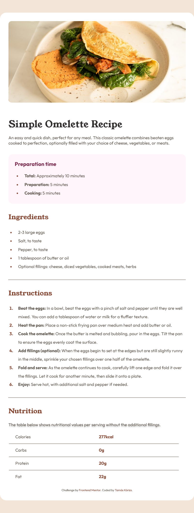

# Frontend Mentor - Recipe page solution

This is a solution to the [Recipe page challenge on Frontend Mentor](https://www.frontendmentor.io/challenges/recipe-page-KiTsR8QQKm). Frontend Mentor challenges help you improve your coding skills by building realistic projects.

## Table of contents

- [Overview](#overview)
  - [The challenge](#the-challenge)
  - [Screenshot](#screenshot)
  - [Links](#links)
- [My process](#my-process)
  - [Built with](#built-with)
  - [What I learned](#what-i-learned)
  - [Continued development](#continued-development)
  - [Useful resources](#useful-resources)
- [Author](#author)

## Overview

### Screenshot



### Links

- Solution URL: [Add solution URL here](https://your-solution-url.com)

## My process

### Built with

- Semantic HTML5 markup
- CSS custom properties
- Flexbox
- Mobile-first workflow

### What I learned

In this project I have learned using @font-face and variables for colors. In HTML I tried to use BEM methodology

```css
@font-face {
  font-family: "Young Serif";
  src: url('assets/fonts/young-serif/YoungSerif-Regular.ttf');
  font-weight: 400;
}

@font-face {
  font-family: "Outfit";
  src: url('assets/fonts/outfit/Outfit-VariableFont_wght.ttf');
  font-weight: 400;
}

@font-face {
  font-family: "Outfit";
  src: url('assets/fonts/outfit/Outfit-VariableFont_wght.ttf');
  font-weight: 600;
}

@font-face {
  font-family: "Outfit";
  src: url('assets/fonts/outfit/Outfit-VariableFont_wght.ttf');
  font-weight: 700;
}

:root {
  --white: hsl(0, 0%, 100%);
  --stone-100: hsl(30, 54%, 90%);
  --stone-150: hsl(30, 18%, 87%);
  --stone-600: hsl(30, 10%, 34%);
  --stone-900: hsl(24, 5%, 18%);
  --brown-800: hsl(14, 45%, 36%);
  --rose-800: hsl(332, 51%, 32%);
  --rose-50: hsl(330, 100%, 98%);
}
```

### Continued development

I am not very comfortable with BEM yet. In the future projects I try to practice it.

### Useful resources

- [BEM methodology](https://medium.com/@shirleyberchel/bem-methodology-a-comprehensive-guide-to-css-optimization-88bbf282901e "BEM") - This helped me for BEM methodology.

## Author

- Frontend Mentor - [@korizst](https://www.frontendmentor.io/profile/korizst "Tamás Kórizs")
